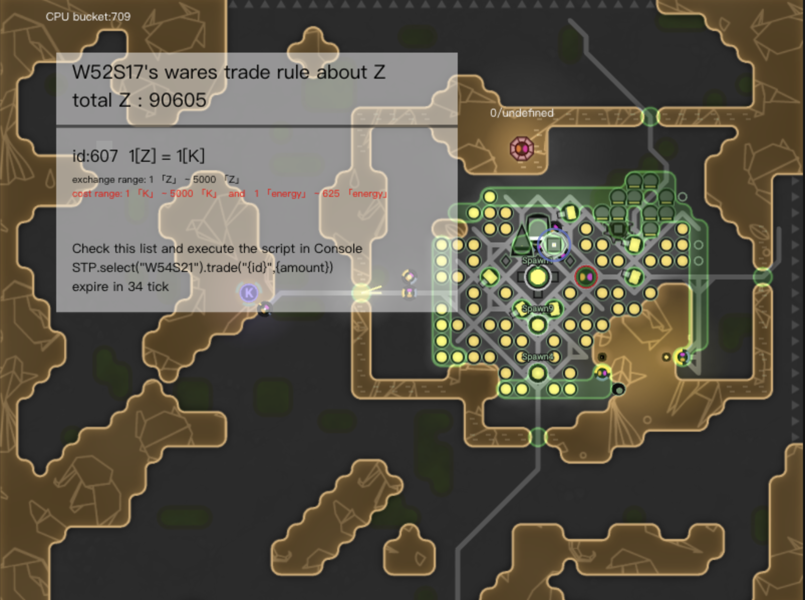

# screeps-trade-protocol

A screeps room terminal protocol of resource trade

language: [EN](readme-en.MD) | [中文](readme.MD)

----

This protocol is specifically designed to serve players' private terminal transactions. Sellers set their own exchange rules, and buyers can use the protocol to exchange resources according to the rules set by even throgh the seller is offline.

## usage

1. copy the ```src/index.js``` and rename it in your code like ```screeps_trade_protocol```.

2. add "run()" function in your loop, to listen incomming message.

```js
// main.js
const STP = require('screeps_trade_protocol')

global.STP=STP // set global api

module.export.loop=()=>{
    ...

    STP.run()
}

```

3. call open to start marketing

```STP.open("W1S1")```

4. as a saler to set trade rules

```ts
type Rule = {
    id?: string,
    /** 商品类型 */
    resourceType: ResourceConstant,
    /** 交换物类型 */
    exchangeResourceType: ResourceConstant,
    /** 汇率 */
    raito: number
}

```

create a function to set rule and call it once

```

global.setRuleInW1S1=setRuleInW1S1

function setRuleInW1S1(){
    
    const rules=[
        {
            resourceType: RESOURCE_ENERGY,
            exchangeResourceType: RESOURCE_KEANIUM,
            raito: 0.05
        },
        {
            resourceType: RESOURCE_ZYNTHIUM,
            exchangeResourceType: RESOURCE_KEANIUM,
            raito: 1
        }
    ]
    
    STP.select('W1S1').setRules(rules)
}
```

5. as a buyer to start a trade

connect terminal
```STP.select("W1S1").connect("W2S2",RESOURCE_ZYNTHIUM) // you are tring buy some Z in W2S2 ```

and then your RoomVisual will popup a rules card shown the resource trade rules in target room



read saler's rules list,and select one if you want

exec the script in Console and ensure amount is in range

```STP.select("W1S1").trade("{id}",{amount})```