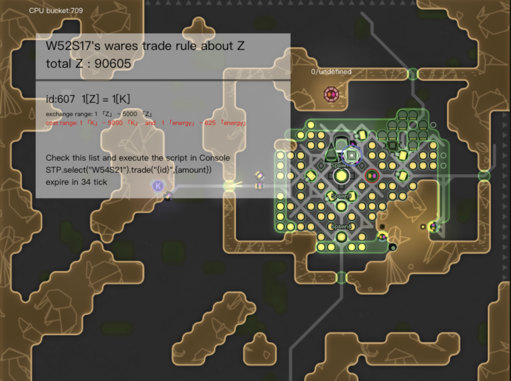

# screeps-trade-protocol

一个用于《Screeps》游戏 room 间交换资源的协议

语言: [en](readme-en.MD) | [中文](readme.MD)

----

这个协议为了玩家方便私下使用terminal进行交易。卖家设置好交换的规则，买家可以使用协议去按照规则交换这些资源，即使卖家离线，也可以完成这次交易。

## 使用方法

1. 复制并重命名 ```src/index.js``` 例如 ```screeps_trade_protocol```. 然后放到你的代码里

2. 在loop循环中调用 run 函数去监听 incomming message

```js
// main.js
const STP = require('screeps_trade_protocol')

global.STP=STP // set global api

module.export.loop=()=>{
    ...

    STP.run()
}

```

3. 调用open函数开市

```STP.open("W1S1")```

4. 卖家设置交易规则

```ts
type Rule = {
    id?: string,
    /** 商品类型 */
    resourceType: ResourceConstant,
    /** 交换物类型 */
    exchangeResourceType: ResourceConstant,
    /** 汇率 */
    raito: number
}

```

创建一个设置规则的函数，并调用他1次

```

global.setRuleInW1S1=setRuleInW1S1

function setRuleInW1S1(){
    
    const rules=[
        {
            resourceType: RESOURCE_ENERGY,
            exchangeResourceType: RESOURCE_KEANIUM,
            raito: 0.05
        },
        {
            resourceType: RESOURCE_ZYNTHIUM,
            exchangeResourceType: RESOURCE_KEANIUM,
            raito: 1
        }
    ]
    
    STP.select('W1S1').setRules(rules)
}
```

5. 卖家调用 connect 发起交易

链接终端
```STP.select("W1S1").connect("W2S2",RESOURCE_ZYNTHIUM) // 尝试在 W2S2 房间买一些 Z ```

之后你对应房间的 RoomVisual 会弹出一个对应资源卖家的交换规则卡片



阅读卖家交易规则，并选择一个你想要交换的规则

执行这条脚本，并确保你的 amount 在交易范围内

```STP.select("W1S1").trade("{id}",{amount})```
